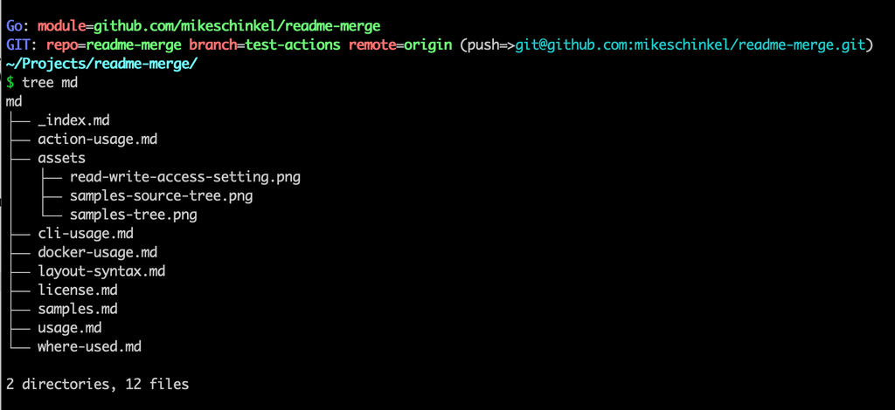

# README Merge
GitHub Action, Docker Container, and CLI tool to allow merging child documents into one `README.md`

**BE CAREFUL**: This will _**overwrite**_ your `README.md` file. 

## Usage


### Simple CLI Usage

#### Syntax
```go
readme-merge <index_file> <readme_path> [no_commit]
```
#### Example
```go
readme-merge md/_index.md . no_commit
```

### GitHub Action Usage

In order to configure this GitHub Action to work for your repository you need to do the following three (3) things:

1. Add a directory of source Markdown files and an entry point file
1. Set Read/Write Access
2. Add a workflow .YAML file

#### 1. Create Source Dir and Entry-point File
README Merge reads an entry point file in a subdirectory that defaults — if you do not specify otherwise in your workflow — to `./md/_index.md` where `/md` is a subdirectory off the root.

For more details about the entry-point file and document syntax see [Layout and Syntax](./layout-syntax.md).

#### 2. Set Read/Write Access
As the entire purpose of this action is to build the `README.md` this action cannot perform its purpose unless it can update the GitHub repo. **If you have security concerns about write access see the [security section below](#security-considerations).**

To configure your GitHub repo for to allow writes, visit your repo's Settings from the top GitHub menu, select GitHub Actions and then follow the instructions in this screenshot:


#### 3. Workflow using the Github Action
Save the following code as `.github/workflows/generate-readme.yaml` in your repo and commit.  

No changes necessary if:
1. Your source Markdown files are in a subdirectory `/md` off your repo's root,
2. Your entry point document in your subdirectory is named `_index.md`,
3. You use `main` as your primary branch, and 
4. You want to update the `README.md` on push the `main`.

If you have more complex needs and/or use-cases then modifications to this workflow will obviously be required:

```go
name: Generate README

on:
  push:
    branches:
    - main
    - test-actions

jobs:
  generate-readme:
    runs-on: ubuntu-latest
    steps:
    - name: Checkout repository
      uses: actions/checkout@v4

    - name: Generate README
      uses: mikeschinkel/readme-merge@main
      with:
        index_filepath: './md/_index.md'
        readme_dir: '.'
      env:
        GITHUB_TOKEN: ${{ secrets.GITHUB_TOKEN }}
```

#### SECURITY CONSIDERATIONS
This GitHub Action requires read and **write** access to your repository so it can update the `README.md` file. The updates happen in the shell script `/bin/entrypoint.sh` for your security review.

If you cannot set read/write access because your security team does not allow it, or you simply do not want to allow write access to GitHub Actions on your repo _then do not use this GitHub Action_ and instead either use the Docker container or the `readme-merge` executable elsewhere in your CI/CD and/or README authoring process. 


### Docker Container Usage

#### Syntax
```go
docker build -t readme-merge:<your_tag> ../

docker run -v "<your_local_repo_root>:/app/<repo_in_container>" --rm \
  readme-merge:<your_tag> \
    ./<repo_in_container>/<local_markdown_source_dir>/<entry_point_doc> \
    ./<repo_in_container>/<local_dir_for_readme> \
    [commit|no_commit]
```
#### Example
```go
docker build -t readme-merge:your_tag ../

docker run -v "$(pwd)/..:/app/repo" --rm \
  readme-merge:local_usage \
    ./repo/samples/md/_index.md \
    ./repo/samples/. \
    no_commit
```


## Layout and Syntax
Layout and syntax for README Merge has deliberately designed to be very simple. You only need:

1. Directory for Markdown files
2. Entry-point source Markdown file 
3. Other source Markdown files
4. Merge Directives in Source files

### Directory and Entry-point File:

Your source directory of Markdown files should have an entry point file which by convention README Merge names `_index.md` in the `./md` subdirectory off the repository's root. 

Note that if you use those names — e.g. `./md/_index.md` — you will not need to specify them when using the GitHub Action. 

### Other Source Markdown Files:

Other source files are just Markdown files in the same directory as the `_index.md`file that can be merged. The first special cases for how they need to be authored is discussed below. 

### Syntax for Merge Directives

Your entry point file — which I will refer to as `_index.md` from here on in this section —  should have one or more `[merge]` directives. They are the same syntax as a link but use the word `merge` as a special keyword.

#### Merged Directives Start in Column One
From [the samples `_index.md` file](./samples/md/_index.md) — shown below — you can see that the `[merge] directive **MUST** be in the first column or README Merge will ignore it. This allows you to still link the work merge to somewhere if you have that need:

##### File `./samples/md/_index.md`
```markdown
## Just a Sample README-merge Index Template


## Footer
```

#### Merged documents may be Nested

As you can see from [the samples `foo.md` file](./samples/md/foo.md) — merged above and shown below — you can see that the merged files can also contain `[merge] directives:

##### File `./samples/md/_foo.md`
```markdown
## Foo Template

This is the Foo template

```

#### Headers Must Use Hash Characters 

To avoid scope-creep and additional complexity README Merge does not support underlines to indicate headers.  Headers must use hash (`#`) characters, e.g:

```markdown
##
###
####
#####
######
```

#### Headers Start in Column One 

```markdown

## Good Header

 # Bad Header
 
  # Worse Header
```

To simplify implementation headers **MUST** be placed in column one (1) or they will be ignored by README Merge. 

The reason for this is that the first non-whitespace characters in source code examples are occassionally `#` characters — which as comments in Shell scripts nd Ruby source code — so to keep parsing simple we have decided to require headers to be in column 1. This requirement also limits potential bugs.

If this becomes a problem we can potentially enhance README Merge to recognize headings with up to three (3) space characters before the (first) `#`, but we won't do that until it becomes a repeated sore point for users.

#### Merged Headers Will be Demoted

One reason the author built this was he hated having to author Markdown files as parts of a whole that could not live on their own as standalone Markdown files.

Specifically, if a Markdown file with a level 1 heading — e.g. `#` — is merged in to an `_index.md` file then that level 1 heading would compete with the level 1 heading of the `_index.md` file and thus with the resultant `README.md` output file. 

To solve this, README Merge demotes any headings of a merged document by one. For example, if `usage.md` starts with `# Usage` and is merged into `_index.md` then it will appear as `## Usage` in the output `README.md`.

This is further true of nested documents. This is `docker-usage.md` is merged into `usage.md` which is merged into `_index.md` and `docker-usage.md` has a header of `# Docker Usage` then in the resultant `README.md` it will appear two levels demoted, or `### Docker Usage`. 

### Examples to Review

To understand the layout and syntax expected by README merge you can review the very simple samples files located in `./samples/md` as seen in the screenshot below:


_Directory tree for sample Markdown source files._


Alternately you can look at the source markdown files for this repo's `README.md` in the `./md`:


_Directory tree for Markdown source files for this repo._


## Samples

There is a very simply set of Markdown documents in the `/samples/md` directory. 


### Building the sample `README.md` 
You can see how the samples work by running the following commands which will build a Docker container to run `go build` and then run `readme-merge` which will merge the sample docs into an example `README.md` file as `/samples/README.md` and then use `less` to view it:

```shell
git clone https://github.com/mikeschinkel/readme-merge
cd readme-merge/samples
./build-sample-readme.sh
```

### Requirements for running `build-sample-readme.sh`
To build the sample `README.md` you need:

- To be running a flavor of *nix _(Linux, macOS, WSL, etc)_
- To have a running [Docker daemon installed](https://docs.docker.com/engine/install/).

There is not batch file or PowerShell script for use if you are running Windows but if you are motivated you can port `./samples/build-sample-readme.sh` and support a PR to include for future Windows users.  

## Where Used
- [github.com/mikeschinkel/readme-merge](https://github.com/mikeschinkel/readme-merge)
- [github.com/mikeschinkel/php-file-scoped-visibility-rfc](https://github.com/mikeschinkel/php-file-scoped-visibility-rfc)

If you use README Merge please consider submitting a pull request with a link to your repo using to contained in `./md/where-used.md`.

## License 
MIT

## End
